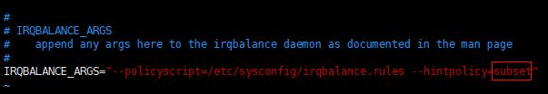
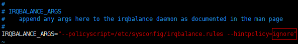

# 裸金属服务器绑定128个eth网络设备时，网络性能差，如何解决？

## 问题背景

在EulerOS 2.3和EulerOS 2.5裸金属服务器上，绑定多个eth网络设备（比如128个单队列网卡）时，网络性能差。这是因为128个网卡队列都中断到同一个CPU上，导致该CPU严重瓶颈影响网络性能。网卡队列中断CPU严重不均衡的原因是EulerOS 2.3和EulerOS 2.5 irqbalance程序的hintpolicy默认策略subset导致，按[操作步骤](#section590314415578)将策略改成ignore即可。

> **说明：** 
>irqbalance程序的hintpolicy是一种用来控制中断平衡的策略，内核会为每一个中断提供一个affinity\_hint值，告诉irqbalance此中断倾向的CPU亲和性。其取值有三个：
>-   exact：irqbalance程序会严格按照内核的affinity\_hint值进行亲和性平衡
>-   subset：irqbalance程序会以affinity\_hint的一个子集进行亲和性平衡
>-   ignore：完全忽略内核的affinity\_hint

## 操作步骤

以操作系统EulerOS 2.3为例，具体操作如下：

1.  使用root帐号登录裸金属服务器。
2.  执行以下命令，在vi编辑器中打开“/etc/sysconfig/irqbalance”。

    **vi /etc/sysconfig/irqbalance**

3.  文件原始参数--hintpolicy=subset，如下：

    

    修改为--hintpolicy=ignore，如下：

    

