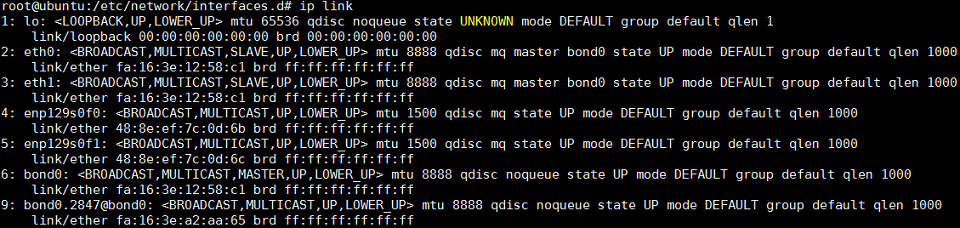
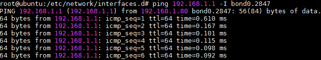

# 误升内核的场景，如何回退至原始内核版本？<a name="bms_faq_0060"></a>

## 问题背景<a name="section1524442817234"></a>

裸金属服务器中SDI、RAID及IB等硬件驱动跟内核相关，不建议升级内核版本。

如果已经升级且相关功能出现异常可按照以下方法进行规避处理。以CentOS 7.2操作系统为例，介绍如何在内核升级后设置从默认内核启动。

## 升级场景复现<a name="section751094152410"></a>

1.  执行**uname -a**命令，查看原始内核版本。

    ```
    [root@bms-centos ~]# uname -a
    Linux bms-centos 3.10.0-327.el7.x86_64 #1 SMP Thu Nov 29 14:49:43 UTC 2018 x86_64 x86_64 x86_64 GNU/Linux
    ```

2.  执行**yum update kernel**命令，升级内核。
3.  执行**cat /boot/grub2/grub.cfg |grep menuentry**命令，查看升级完成后操作系统的内核信息。

    其中，标注的“3.10.0-327.el7.x86\_64”为默认内核，“3.10.0-862.3.2.el7.x86\_64”为升级后的内核版本。

    


## 升级内核后应急设置<a name="section16106241597"></a>

1.  设置原始内核版本为默认启动内核，验证修改结果。

    **grub2-set-default "CentOS Linux \(3.10.0-327.el7.x86\_64\) 7 \(Core\)"**

    **grub2-editenv list**

    ```
    [root@bms-centos ~]# grub2-editenv list
    saved_entry-CentOS Linux (3.10.0-327.el7.x86_64) 7 (Core)
    ```

2.  验证完成后从默认内核重新启动系统。

    

3.  执行**uname -a**命令，验证是否已恢复内核版本。

