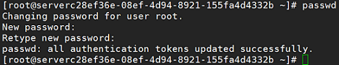

# 远程登录方式

如果普通远程连接软件（如PuTTY）无法使用，您可以通过管理控制台的“远程登录”连接裸金属服务器实例，查看服务器操作界面。

## 约束限制

-   仅Linux操作系统的裸金属服务器支持远程登录。
-   只有该裸金属服务器的创建者，或者拥有Tenant Administrator或Server Administrator角色的用户才能远程登录该裸金属服务器。
-   裸金属服务器远程登录的界面不支持中文输入法，不支持桌面图形化操作。
-   裸金属服务器远程登录，对Ctrl、Alt等快捷键支持不够友好，比如“Alt + ASCII码”表示的特殊字符会输出多个特殊字符。
-   在关闭管理控制台前，请先退出操作系统的用户登录。

## 前提条件

-   裸金属服务器已经创建成功。
-   您在创建裸金属服务器时，已经设置了登录密码。如果未设置或者忘记了密码，您可以[一键式重置密码](一键式重置密码.md)。
-   您在创建裸金属服务器时，如果选择密钥对（KeyPair）登录方式，需要先[使用SSH密钥方式](SSH密钥方式登录.md)登录裸金属服务器设置密码才可以进行远程登录。具体操作如下：

    使用密钥登录裸金属服务器后切换到root用户，执行**passwd**命令即可设置密码。

    **图 1**  设置root密码  
    

## 操作步骤

1.  登录管理控制台。
2.  选择“计算 \>  裸金属服务器”。

    进入裸金属服务器页面。

3.  选择一台裸金属服务器，单击“操作”列的“远程登录”。

    开始建立连接，大约1分钟后进入登录界面，按“Enter”后输入用户名和密码即可登录。

    > **说明：**   
    >-   获取远程登录链接后，如果10分钟内未登录，则该链接失效，需要重新获取。  
    >-   远程登录的界面如果10分钟未操作，则该页面失效，需要重新获取链接并登录。  
    >-   如果在登录界面按“Enter”后没有响应，可能因为该裸金属服务器所使用的镜像未配置远程登录功能，请参考[远程登录裸金属服务器时界面操作无响应，如何解决？](https://support.huaweicloud.com/bms_faq/bms_faq_0026.html)解决。  
    >-   远程登录裸金属服务器后，如果控制台显示异常（比如错行、乱码），请参考[远程登录裸金属服务器后控制台显示异常，如何解决？](https://support.huaweicloud.com/bms_faq/bms_faq_0027.html)解决。  

