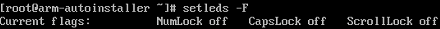

# 远程登录时，输入键盘右侧数字键显示异常，怎么办？

## 问题描述

在远程登录界面，输入键盘右侧的数字键时，出现如下图数字显示异常的现象。

## 解决方案

通过Linux setleds命令将数字键打开即可，方法如下：

1.  在远程登录界面输入以下命令，查询数字键状态。

    **setleds -F**

    

    其中，NumLock为off，表示数字键为关闭状态。

2.  执行以下命令，打开数字键。

    **setleds +num**

3.  再次执行**setleds -F**命令，可以看到NumLock已经变为on，然后就可以使用键盘右侧数字键进行相关操作了。

