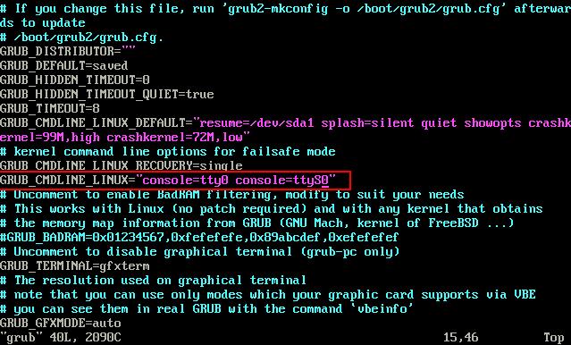
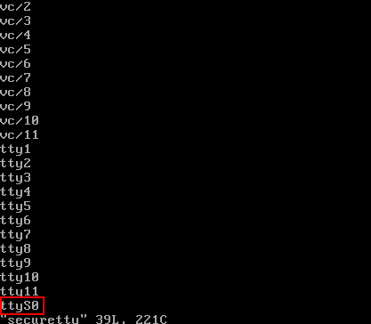

# 远程登录裸金属服务器时界面操作无响应，如何解决？

## 问题描述

远程登录裸金属服务器时，按“Enter”后界面无任何响应。

## 可能原因

裸金属服务器操作系统内部配置不允许通过远程访问。

## 解决方案

使用密钥对（KeyPair）登录裸金属服务器，进入操作系统进行相关设置，各操作系统的配置有所不同，以下仅提供部分操作系统配置示例，详细可参考《裸金属服务器私有镜像制作指南》的“[配置裸金属服务器远程登录](https://support.huaweicloud.com/bpicg-bms/bms_03_0045.html)”章节。

1.  修改配置文件。
    -   对于SUSE Linux Enterprise Server 12 SP2/SUSE Linux Enterprise Server 12 SP1/Ubuntu 16.04 Server/CentOS Linux 7.3/EulerOS 2.2操作系统，使用vi编辑器打开“/etc/default/grub”，在“GRUB\_CMDLINE\_LINUX”字段内容后添加“console=tty0 console=ttyS0”。

        **图 1**  修改示例  
        

    -   对于Oracle Linux 7.3/Red Hat Enterprise Linux 7.3操作系统，使用vi编辑器打开“/etc/sysconfig/grub”，在“GRUB\_CMDLINE\_LINUX”字段内容后添加“console=tty0 console=ttyS0”。

        **图 2**  修改示例  
        

2.  刷新配置。
    -   对于SUSE Linux Enterprise Server 12 SP2/Oracle Linux 7.3/Red Hat Enterprise Linux 7.3/CentOS Linux 7.3/EulerOS 2.2操作系统，执行以下命令刷新。

        **stty -F /dev/ttyS0 speed 115200**

        **grub2-mkconfig -o /boot/grub2/grub.cfg**

        **systemctl enable serial-getty@ttyS0**

    -   对于Ubuntu 16.04 Server操作系统，执行以下命令刷新。

        **stty -F /dev/ttyS0 speed 115200**

        **grub-mkconfig -o /boot/grub/grub.cfg**

        **systemctl enable serial-getty@ttyS0**

3.  （可选）修改安全配置文件。

    如果使用root用户通过串口进行登录，需要修改安全配置文件。在“/etc/securetty”最后添加如下信息：

    **图 3**  修改示例  
    

4.  执行**reboot**重启操作系统。

裸金属服务器操作系统配置完成后，重新远程登录，确认是否可以登录成功。

