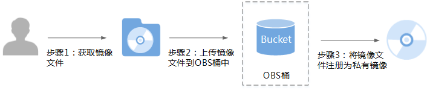

# 通过外部镜像文件创建私有镜像

## 操作场景

您可以通过外部镜像文件创建私有镜像并在云平台上完成注册。创建私有镜像的过程如[图1](#fig7431140101516)所示。

**图 1**  创建过程  

步骤说明如下：

1.  获取镜像文件，请参考《[裸金属服务器私有镜像制作指南](https://support.huaweicloud.com/bpicg-bms/zh-cn_topic_0081116754.html)》了解详细步骤。
2.  上传外部镜像文件到OBS个人桶中，请参考[上传外部镜像文件](#section175082275342)。
3.  通过管理控制台选择上传的镜像文件，并将镜像文件注册为私有镜像，请参考[注册私有镜像](#section17202836566)。

## 上传外部镜像文件

当前云平台支持导入vhd、vmdk、qcow2、raw、vhdx、qcow、vdi、qed、zvhd或zvhd2等格式镜像文件创建私有镜像。推荐使用qcow2格式的镜像文件。如果您需要导入其他格式的镜像，请先使用qemu-img工具转换镜像的格式后再导入，详细操作请参见[镜像格式转换](镜像格式转换.md)。

请使用OBS Browser工具上传外部镜像文件，详细操作请参见《[对象存储服务工具指南（OBS Browser）](https://support.huaweicloud.com/clientogw-obs/zh-cn_topic_0045829115.html)》。

上传外部镜像文件到OBS桶时，OBS桶和镜像文件的存储类别必须为标准存储。

请点击如下链接下载OBS Browser工具：

[http://static.huaweicloud.com/upload/files/tools/OBSBrowser.zip](http://static.huaweicloud.com/upload/files/tools/OBSBrowser.zip)

## 注册私有镜像

1.  登录管理控制台。
2.  选择“计算 \> 镜像服务”。

    进入镜像服务页面。

3.  单击“创建镜像”，填写如下信息：

    **镜像类型和来源**

    -   创建方式：选择“系统盘镜像”。
    -   选择镜像源：选择“镜像文件”，使用外部镜像文件作为源注册私有镜像。

        在桶列表中选择保存镜像文件的桶，再选择对应的镜像文件。

    **配置信息**

    -   镜像用途：选择“BMS系统盘镜像”。

        请确保已参考《[裸金属服务器私有镜像制作指南](https://support.huaweicloud.com/bpicg-bms/zh-cn_topic_0081116754.html)》完成镜像文件的初始化配置。

    -   操作系统：该配置项可选，选择镜像文件对应的操作系统。

        为保证镜像的正常创建和使用，请确保选择的操作系统与镜像文件的操作系统类型一致。

    -   系统盘：设置系统盘容量。该值建议为镜像文件的系统盘大小增加2G。
    -   名称：输入镜像名称。只能由字母、数字、空格和特殊字符“-”、“\_”、“.”组成，且首尾字符都不能为空格。
    -   标签：该配置项可选，为镜像设置标签键和标签值，便于识别和管理。
    -   描述：该配置项可选，对镜像进行描述。

4.  单击“立即创建”。

    在“确认规格”页面，确认规格无误后，单击“提交”。

    > **说明：**   
    >根据镜像文件大小不同，注册私有镜像所使用的时间不同，请耐心等待。  

5.  页面跳转至镜像列表，可以看到正在创建的私有镜像，待状态变为“正常”时，表示注册成功。

## 后续操作

私有镜像注册成功后，您可能想[通过私有镜像创建裸金属服务器](通过私有镜像创建裸金属服务器.md)。

