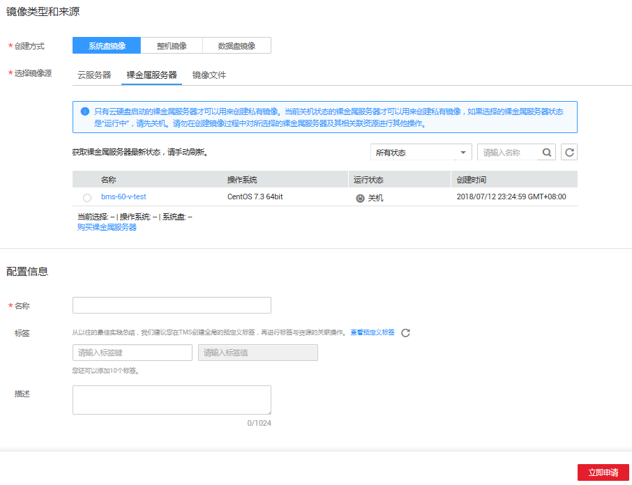
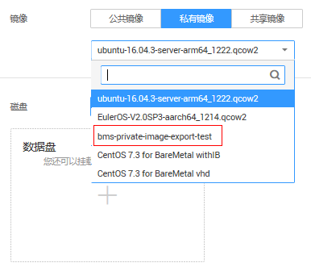

# 通过裸金属服务器创建私有镜像

## 操作场景

您可以基于裸金属服务器实例创建私有镜像，将实例的系统盘数据完整地复制到私有镜像中。系统盘一般包含用户运行业务所需的操作系统、应用软件。

## 约束限制

-   只有系统盘为云硬盘时，才支持此操作。
-   暂不支持将裸金属服务器实例的数据盘导出为镜像。
-   裸金属服务器实例必须为“关机”状态。
-   此操作依赖于裸金属服务器镜像中的bms-network-config和Cloud-init插件。
    -   如果待创建私有镜像的裸金属服务器使用的是公共镜像，镜像中已内置bms-network-config和Cloud-init插件。
    -   如果待创建私有镜像的裸金属服务器使用的是私有镜像，请参考《[裸金属服务器私有镜像制作指南](https://support.huaweicloud.com/bpicg-bms/zh-cn_topic_0081116559.html)》确认是否已安装并配置bms-network-config和Cloud-init插件。

## 操作须知

-   请将裸金属服务器实例中的敏感数据删除后再创建私有镜像，避免数据安全隐患。
-   创建私有镜像的过程中，请不要改变实例的状态，避免创建失败。

## 操作步骤

1.  登录管理控制台。
2.  选择“计算 \> 裸金属服务器”。

    进入裸金属服务器页面。

3.  在需要导出系统盘的裸金属服务器的“操作”列，单击“更多 \> 关机”。

    只有关机状态的裸金属服务器才能制作私有镜像。

4.  待裸金属服务器状态变为“关机”时，单击“操作”列的“更多 \> 制作镜像”。

    进入“创建镜像”页面。

    **图 1**  创建私有镜像  
    

5.  填写镜像名称，根据需要设置标签并输入该镜像的描述。

    设置完成后，单击“立即申请”。

6.  在“确认规格”页面，确认规格无误后，单击“提交”。
7.  页面跳转至镜像列表，可以看到正在创建的私有镜像，待状态变为“正常”时，表示创建成功。

## 后续操作

成功创建私有镜像后，您可能想[通过私有镜像创建裸金属服务器](通过私有镜像创建裸金属服务器.md)。在创建裸金属服务器页面，选择私有镜像下拉框中的镜像。

**图 2**  私有镜像页签  

