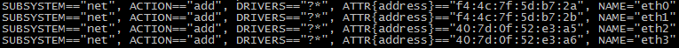
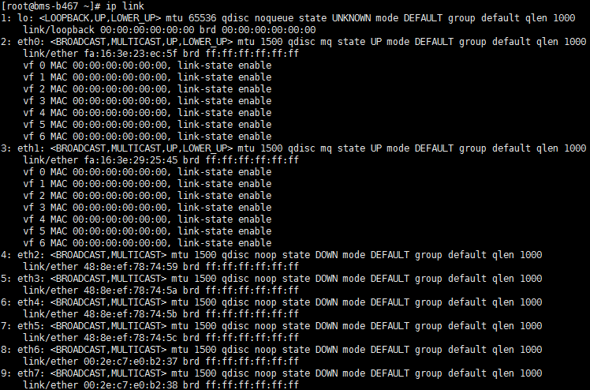

# 配置增强高速网卡（RedHat系列，CentOS系列，Oracle Linux系列，Euler系列）<a name="bms_01_0073"></a>

下面以CentOS 6.9 \(x86\_64\)操作系统为例，举例介绍裸金属服务器增强高速网卡的配置方法。

> **说明：** 
>RedHat系列、Oracle Linux系列、Euler系列及CentOS系列操作系统的配置方法类似。

## 增加网卡<a name="section16410175114208"></a>

以“root”用户，使用密钥或密码登录裸金属服务器。执行如下命令：

**blkid** **|** **grep** **config-2**

如果输出结果为空，请采用[配置方式二](#li20529112891117)；如果输出结果如下图所示，请采用[配置方式一](#li1134025893)。


-   <a name="li1134025893"></a>配置方式一：

1.  以“root”用户，使用密钥或密码登录裸金属服务器。
2.  <a name="li0616194735713"></a>进入裸金属服务器的命令行界面，查询网卡信息。

    **ip** **link**

    返回信息示例如下：

    

    > **说明：** 
    >其中，“eth0”和“eth1”为承载VPC网络的网络设备，“eth2”和“eth3”为承载增强高速网络的网络设备。

3.  执行以下命令，查看“/etc/udev/rules.d/”目录下是否有“80-persistent-net.rules”配置文件。

    **ll** **/etc/udev/rules.d/** **|** **grep** **80-persistent-net.rules**

    -   如果存在“80-persistent-net.rules”，且该配置文件中已存在[2](#li0616194735713)中查询到的除“bond0”和“lo”以外的其它所有网卡和对应的MAC地址，请执行[6](#li1437634425719)。
    -   否则，继续执行[4](#li116366367312)。

4.  <a name="li116366367312"></a>执行以下命令，将“/etc/udev/rules.d/70-persistent-net.rules”文件拷贝一份（文件名为“/etc/udev/rules.d/80-persistent-net.rules”）。

    **cp** **-p** **/etc/udev/rules.d/70-persistent-net.rules** **/etc/udev/rules.d/80-persistent-net.rules**

    > **说明：** 
    >如果没有“/etc/udev/rules.d/70-persistent-net.rules”文件，请直接创建“/etc/udev/rules.d/80-persistent-net.rules”文件，按如下格式填写内容：
    >```
    >SUBSYSTEM=="net", ACTION=="add", DRIVERS=="?*", ATTR{address}=="4c:f9:5d:d9:e8:ac", NAME="eth0"
    >SUBSYSTEM=="net", ACTION=="add", DRIVERS=="?*", ATTR{address}=="4c:f9:5d:d9:e8:ad", NAME="eth1"
    >```

5.  设置udev规则。

    将[2](#li0616194735713)中查询到的除“eth0”和“eth1”以外的网卡（即“/etc/udev/rules.d/70-persistent-net.rules”中未体现的网卡MAC地址和名称），写入“/etc/udev/rules.d/80-persistent-net.rules”文件中，使得裸金属服务器重启复位后，网卡名称和顺序不会发生改变。

    > **说明：** 
    >网卡的MAC地址和名称中的字母，请使用小写字母。

    **vi** **/etc/udev/rules.d/80-persistent-net.rules**

    修改后的示例如下：

    

    修改完成后，按“Esc”，输入**:wq**保存并退出。

6.  <a name="li1437634425719"></a>执行以下命令，将网络配置文件“/etc/sysconfig/network-scripts/ifcfg-bond0”拷贝为“/etc/sysconfig/network-scripts/ifcfg-bond1”，将网络配置文件“/etc/sysconfig/network-scripts/ifcfg-eth0”拷贝为“/etc/sysconfig/network-scripts/ifcfg-eth2”和“/etc/sysconfig/network/ ifcfg-eth3”。

    **cp** **-p** **/etc/sysconfig/network-scripts/ifcfg-bond0** **/etc/sysconfig/network-scripts/ifcfg-bond1**

    **cp** **-p** **/etc/sysconfig/network-scripts/ifcfg-eth0** **/etc/sysconfig/network-scripts/ifcfg-eth2**

    **cp** **-p** **/etc/sysconfig/network-scripts/ifcfg-eth0** **/etc/sysconfig/network-scripts/ifcfg-eth3**

7.  执行以下命令，编辑“/etc/sysconfig/network-scripts/ifcfg-eth2”和“/etc/sysconfig/network-scripts/ifcfg-eth3”，配置“eth2”设备和“eth3”设备的网络配置文件。
    -   **vi** **/etc/sysconfig/network-scripts/ifcfg-eth2**

        “eth2”按以下格式编辑：

        ```
        USERCTL=no
        MTU=8888
        NM_CONTROLLED=no
        BOOTPROTO=static
        DEVICE=eth2
        TYPE=Ethernet
        ONBOOT=yes
        MASTER=bond1
        SLAVE=yes
        ```

        其中，“BOOTPROTO”参数取值修改为“static”，“DEVICE”为对应的网络设备名称，取值即为“eth2”，“MASTER”为对应的增强高速网卡bond的名称，取值如“bond1”，其他参数可保持不变。

    -   **vi** **/etc/sysconfig/network-scripts/ifcfg-eth3**

        “eth3”按以下格式编辑（格式和规则和“eth2”一致）：

        ```
        USERCTL=no
        MTU=8888
        NM_CONTROLLED=no
        BOOTPROTO=static
        DEVICE=eth3
        TYPE=Ethernet
        ONBOOT=yes
        MASTER=bond1
        SLAVE=yes
        ```

8.  执行以下命令，编辑“/etc/sysconfig/network-scripts/ifcfg-bond1”。

    **vi** **/etc/sysconfig/network-scripts/ifcfg-bond1**

    按以下格式编辑：

    ```
    MACADDR=40:7d:0f:52:e3:a5
    BONDING_MASTER=yes
    USERCTL=no
    ONBOOT=yes
    NM_CONTROLLED=no
    BOOTPROTO=static
    BONDING_OPTS="mode=1 miimon=100"
    DEVICE=bond1
    TYPE=Bond
    IPADDR=10.10.10.101
    NETMASK=255.255.255.0
    MTU=8888
    ```

    其中，

    -   “MACADDR”参数取值修改为增强高速网卡“eth2”或者“eth3”设备的MAC地址。
    -   “BOOTPROTO”参数取值修改为“static”。
    -   “DEVICE” 参数取值修改为“bond1”。
    -   “IPADDR” 参数取值修改为待给“bond1”分配的IP地址（为增强高速网络规划的IP地址在没有与VPC网段冲突的情况下可任意规划，需要通过增强高速网络通信的裸金属服务器须将增强高速网络配置在同一个网段），如“10.10.10.101”。
    -   “NETMASK”参数为给增强高速网络“bond1”配置的IP的子网掩码。

    其他参数可保持不变。

    修改完成后，按“Esc”，输入**:wq**保存并退出。

9.  执行以下命令，启动增强高速网络端口组“bond1”。

    首先启动增强高速网卡“eth2”和“eth3”设备。

    **ifup** _eth2_

    **ifup** _eth3_

    **ifup** _bond1_

    .png)

10. 参见上述步骤，完成其他裸金属服务器的配置。
11. 待其他裸金属服务器配置完成后，互相ping对端增强高速网络配置的同网段IP，检查是否可以ping通。

    .png)


-   <a name="li20529112891117"></a>配置方式二：

1.  以“root”用户，使用密钥或密码登录裸金属服务器。
2.  进入裸金属服务器的命令行界面，查询网卡信息。

    **ip** **link**

    返回信息示例如下：

    

    > **说明：** 
    >其中，MAC地址为“fa:16”开头的网卡为承载VPC网络的网络设备，如eth0，eth1；MAC地址为[增强高速网卡查看方式](增强高速网络概述.md#section362012041417)中显示的MAC地址的网卡为承载增强高速网络的网络设备，如eth6，eth7。

3.  执行以下命令，编辑“/etc/sysconfig/network-scripts/ifcfg-eth6”和“/etc/sysconfig/network-scripts/ifcfg-eth7”，配置“eth6”设备和“eth7”设备的网络配置文件。
    -   **vi** **/etc/sysconfig/network-scripts/ifcfg-eth6**

        “eth6”按以下格式编辑：

        ```
        USERCTL=no
        MTU=8888
        NM_CONTROLLED=no
        BOOTPROTO=static
        DEVICE=eth6
        TYPE=Ethernet
        ONBOOT=yes
        MASTER=bond1
        SLAVE=yes
        ```

        其中，“BOOTPROTO”参数取值修改为“static”，“DEVICE”为对应的网络设备名称，取值即为“eth6”，“MASTER”为对应的增强高速网卡bond的名称，取值如“bond1”，其他参数可保持不变。

    -   **vi** **/etc/sysconfig/network-scripts/ifcfg-eth7**

        “eth7”按以下格式编辑（格式和规则和“eth6”一致）：

        ```
        USERCTL=no
        MTU=8888
        NM_CONTROLLED=no
        BOOTPROTO=static
        DEVICE=eth7
        TYPE=Ethernet
        ONBOOT=yes
        MASTER=bond1
        SLAVE=yes
        ```

4.  执行以下命令，编辑“/etc/sysconfig/network-scripts/ifcfg-bond1”。

    **vi** **/etc/sysconfig/network-scripts/ifcfg-bond1**

    按以下格式编辑：

    ```
    MACADDR=00:2e:c7:e0:b2:37
    BONDING_MASTER=yes
    USERCTL=no
    ONBOOT=yes
    NM_CONTROLLED=no
    BOOTPROTO=static
    BONDING_OPTS="mode=1 miimon=100"
    DEVICE=bond1
    TYPE=Bond
    IPADDR=10.10.10.101
    NETMASK=255.255.255.0
    MTU=8888
    ```

    其中，

    -   “MACADDR”参数取值修改为增强高速网卡“eth6”或者“eth7”设备的MAC地址。
    -   “BOOTPROTO”参数取值修改为“static”。
    -   “DEVICE” 参数取值修改为“bond1”。
    -   “IPADDR” 参数取值修改为待给“bond1”分配的IP地址（为增强高速网络规划的IP地址在没有与VPC网段冲突的情况下可任意规划，需要通过增强高速网络通信的裸金属服务器须将增强高速网络配置在同一个网段），如“10.10.10.101”。
    -   “NETMASK”参数为给增强高速网络“bond1”配置的IP的子网掩码。

    其他参数可保持不变。

    修改完成后，按“Esc”，输入**:wq**保存并退出。

5.  执行以下命令，启动增强高速网络端口组“bond1”。

    首先启动增强高速网卡“eth6”和“eth7”设备。

    **ifup** _eth6_

    **ifup** _eth7_

    **ifup** _bond1_

    -1.png)

6.  参见上述步骤，完成其他裸金属服务器的配置。
7.  待其他裸金属服务器配置完成后，互相ping对端增强高速网络配置的同网段IP，检查是否可以ping通。

    -2.png)


**如果需要配置VLAN，则按照以下步骤配置。**

1.  根据需要配置的VLAN，配置相应VLAN子接口。假设VLAN为316，执行以下命令，编辑“/etc/sysconfig/network-scripts/ifcfg-bond1.316”。

    **vi** **/etc/sysconfig/network-scripts/ifcfg-bond1.316**

    按以下格式编辑：

    ```
    USERCTL=no
    ONBOOT=yes
    NM_CONTROLLED=no
    BOOTPROTO=static
    DEVICE=bond1.316
    TYPE=Ethernet
    IPADDR=10.10.0.101
    NETMASK=255.255.255.0
    VLAN=yes
    PHYSDEV=bond1
    ```

    其中，

    -   “DEVICE”参数取值修改为新增的bond子接口名称。
    -   “IPADDR”参数取值修改为待给“bond1.316”分配的IP地址（为增强高速网卡VLAN子接口规划的IP地址在没有与VPC网段冲突的情况下可任意规划，需要通过增强高速网卡VLAN子接口通信的裸金属服务器须将增强高速网卡VLAN子接口配置在同一个网段），如“10.10.0.101”。
    -   “NETMASK”参数为给增强高速网卡“bond1.316”配置的IP的子网掩码。

    其他参数可保持不变。

    修改完成后，按“Esc”，输入**:wq**保存并退出。

2.  待其他裸金属服务器配置完成后，互相ping对端增强高速网络VLAN子接口的同网段IP，检查是否可以ping通。

    .png)


## 删除网卡<a name="section17427175114209"></a>

1.  获取待删除增强高速网卡的bond网卡地址。
2.  以“root”用户，使用密钥或密码登录裸金属服务器。
3.  找到bond关联的网络设备，然后执行命令关闭并删除网络设备。如果bond有VLAN子接口，这一步将自动删除VLAN子接口。

    ```
    [root@bms-centos ~]# ifdown eth2
    [root@bms-centos ~]# ifdown eth3
    [root@bms-centos ~]# ifdown bond1
    [root@bms-centos ~]# ip link delete bond1
    [root@bms-centos ~]# ip link
    1: lo: <LOOPBACK,UP,LOWER_UP> mtu 65536 qdisc noqueue state UNKNOWN 
        link/loopback 00:00:00:00:00:00 brd 00:00:00:00:00:00
    2: eth0: <BROADCAST,MULTICAST,SLAVE,UP,LOWER_UP> mtu 8888 qdisc mq master bond0 state UP qlen 1000
        link/ether fa:16:00:6d:80:29 brd ff:ff:ff:ff:ff:ff
    3: eth1: <BROADCAST,MULTICAST,SLAVE,UP,LOWER_UP> mtu 8888 qdisc mq master bond0 state UP qlen 1000
        link/ether fa:16:00:6d:80:29 brd ff:ff:ff:ff:ff:ff
    4: eth2: <BROADCAST,MULTICAST> mtu 8888 qdisc mq state DOWN qlen 1000
        link/ether 40:7d:0f:52:e3:a5 brd ff:ff:ff:ff:ff:ff
    5: eth3: <BROADCAST,MULTICAST> mtu 8888 qdisc mq state DOWN qlen 1000
        link/ether 40:7d:0f:52:e3:a6 brd ff:ff:ff:ff:ff:ff
    6: bond0: <BROADCAST,MULTICAST,PROMISC,MASTER,UP,LOWER_UP> mtu 8888 qdisc noqueue state UP 
        link/ether fa:16:00:6d:80:29 brd ff:ff:ff:ff:ff:ff
    ```

4.  执行以下命令，删除网络配置文件“/etc/sysconfig/network-scripts/ifcfg-eth2”、“/etc/sysconfig/network-scripts/ifcfg-eth3”和“/etc/sysconfig/network-scripts/ifcfg-bond1”。

    **rm** **-f** **/etc/sysconfig/network-scripts/ifcfg-eth2**

    **rm** **-f** **/etc/sysconfig/network-scripts/ifcfg-eth3**

    **rm** **-f** **/etc/sysconfig/network-scripts/ifcfg-bond1**__

    如果有VLAN子接口，删除网络配置文件“/etc/sysconfig/network-scripts/ifcfg-bond1._vlan_”，其中vlan表示VLAN子接口的VLAN，如316。

    **rm** **-f** **/etc/sysconfig/network-scripts/ifcfg-bond1.**_316_


