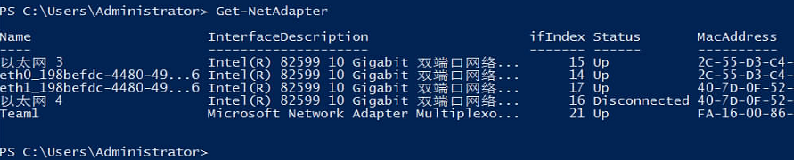
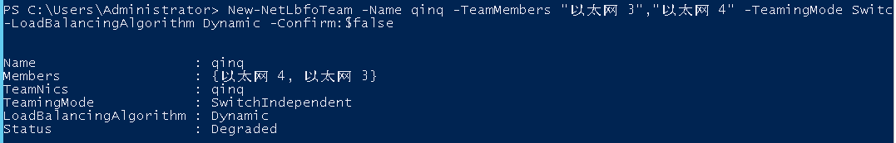
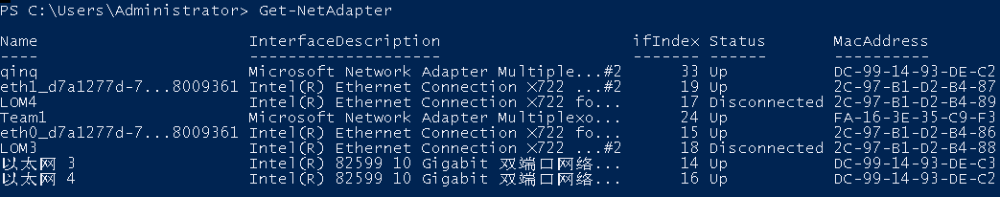
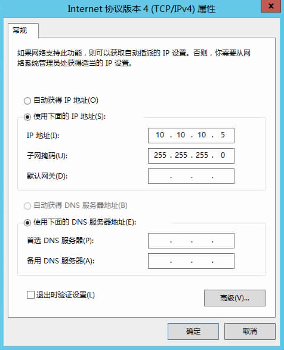
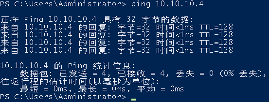
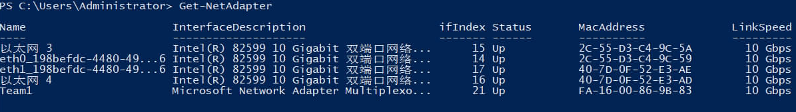

# 配置增强高速网卡（Windows Server系列）

下面以Windows Server 2012 R2 Standard操作系统为例，举例介绍裸金属服务器增强高速网络bond的配置方法。

> **说明：**   
>Windows Server系列其他操作系统的配置方法与Windows Server 2012 R2 Standard类似。  

## 增加网卡

1.  登录Windows裸金属服务器。
2.  进入裸金属服务器的Windows PowerShell命令行界面，执行以下命令，查询网卡信息。

    **Get-NetAdapter**

    返回信息示例如下：

    

    > **说明：**   
    >其中，“eth0”和“eth1”为承载VPC网络的网络设备，“以太网 3”和“以太网 4”为承载增强高速网络bond的网络设备。下面步骤将使用“以太网 3”和“以太网 4”配置增强高速网络。  

3.  如果想提高OS侧出方向流量请参考[方法一](#li4677195455)配置；如果对流量没有特殊要求，请参考[方法二](#li193105239458)配置。
    -   **方法一：OS内组bond为交换机独立模式，出方向流量可达到主主的效果，但入方向仍然与主备模式保持一致。**

    1.  执行以下命令，创建增强高速网络bond的端口组。

        **New-NetLbfoTeam** **-Name** _qinq_ **-TeamMembers** **"**_以太网 3_**","**_以太网 4_**"** **-TeamingMode** **SwitchIndependent** **-LoadBalancingAlgorithm** **Dynamic** **-Confirm:$false**

        

        > **说明：**   
        >其中，“qinq”为给增强高速网络端口组规划的端口组名称，“以太网 3”和“以太网 4”为[2](#li11441348154412)中获取的承载增强高速网络的网络设备。  

    2.  执行以下命令，查询网络适配器列表。

        **get-NetLbfoTeamMember**

        

        **Get-NetAdapter**

        

    -   **方法二：主备模式OS内组bond。**

    1.  执行以下命令，创建增强高速网络bond的端口组。

        **New-NetLbfoTeam** **-Name** _Team2_ **-TeamMembers** **"**_以太网 3_**","**_以太网 4_**"** **-TeamingMode** **SwitchIndependent** **-LoadBalancingAlgorithm** **IPAddresses** **-Confirm:$false**

        .png)

        > **说明：**   
        >其中，“Team2”为给增强高速网络端口组规划的端口组名称，“以太网 3”和“以太网 4”为[2](#li11441348154412)中获取的承载增强高速网络的网络设备。  

    2.  执行以下命令，设置[3.a](#li125519380337)中创建的“Team2”端口组中一个网口模式为备用模式。

        **Set-NetLbfoTeamMember** **-Name** **"**_以太网 4_**"** **-AdministrativeMode** **Standby** **-Confirm:$false**

        > **说明：**   
        >当前增强高速网络配置的端口组只支持主备模式，其中，“以太网 4”为组成增强高速网络端口组中的其中一个端口，配置哪个端口为备用端口，根据您的规划自行决定。  

        **get-NetLbfoTeamMember**

        .png)

        **Get-NetAdapter**

        .png)

4.  执行以下命令，进入“网络连接”界面。

    **ncpa.cpl**

    执行完成后，进入如下界面：

    

5.  配置增强高速网络。
    1.  在“网络连接”界面，双击在[3](#li202764020268)中创建的端口组“Team2”，进入“Team2 状态”页面。
    2.  单击“属性”，进入“Team2 属性”页面。
    3.  在“网络”页签下双击“Internet 协议版本 4 \(TCP/IPv4\)”，进入“Internet 协议版本 4 \(TCP/IPv4\) 属性”页面。
    4.  选择“使用下面的IP地址”，配置增强高速网络的IP地址和子网掩码，单击“确定”。

        

        > **说明：**   
        >其中，为增强高速网络规划的IP地址在没有与VPC网段冲突的情况下可任意规划，需要通过增强高速网络通信的裸金属服务器须将增强高速网络配置在同一个网段。  

6.  参见上述步骤，完成其他裸金属服务器的配置。
7.  待其他裸金属服务器配置完成后，互相ping对端增强高速网络配置的同网段IP，检查是否可以ping通。

    

## 删除网卡

1.  登录Windows裸金属服务器。
2.  进入裸金属服务器的Windows PowerShell命令行界面，执行以下命令，查询需要删除的增强高速网卡bond信息。

    **Get-NetLbfoTeamNIC** **-Team** **Team2**

    .png)

3.  执行以下命令，删除网卡bond。

    **Remove-NetLbfoTeam** **-Name** **"Team2"**__

    .png)

4.  执行如下命令，查询网络信息，确认网卡已被删除。

    **Get-NetAdapter**

    

