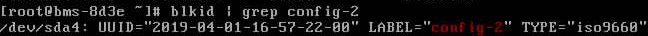
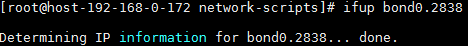
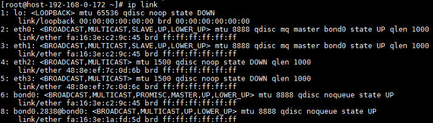
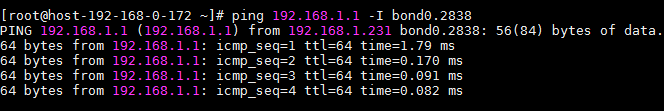
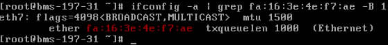

# 配置网卡（RedHat系列，CentOS系列，Oracle Linux系列，Euler系列）<a name="bms_01_0061"></a>

下面以CentOS 6.9 \(x86\_64\)操作系统为例，举例介绍裸金属服务器增删VPC网卡的配置方法。

> **说明：**   
>RedHat系列、Oracle Linux系列、Euler系列及CentOS系列操作系统的配置方法类似。  

## 增加网卡<a name="section208961921154819"></a>

以“root”用户，使用密钥或密码登录裸金属服务器。执行如下命令：

**blkid** **|** **grep** **config-2**

如果输出结果为空，请采用[配置方式二](#li1229716019264)；如果输出结果如下图所示，请采用[配置方式一](#li1134025893)。



-   <a name="li1134025893"></a>配置方式一：

1.  <a name="li1558174719483"></a>获取新增网卡的信息，如[表1](#table1669415379510)所示。

    **表 1**  信息收集

    <a name="table1669415379510"></a>
    <table><thead align="left"><tr id="row1669543725112"><th class="cellrowborder" valign="top" width="18.181818181818183%" id="mcps1.2.4.1.1"><p id="p369643735111"><a name="p369643735111"></a><a name="p369643735111"></a>参数</p>
    </th>
    <th class="cellrowborder" valign="top" width="63.63636363636363%" id="mcps1.2.4.1.2"><p id="p18696537135118"><a name="p18696537135118"></a><a name="p18696537135118"></a>说明</p>
    </th>
    <th class="cellrowborder" valign="top" width="18.181818181818183%" id="mcps1.2.4.1.3"><p id="p1969613379517"><a name="p1969613379517"></a><a name="p1969613379517"></a>样例</p>
    </th>
    </tr>
    </thead>
    <tbody><tr id="row15696143715112"><td class="cellrowborder" valign="top" width="18.181818181818183%" headers="mcps1.2.4.1.1 "><p id="p4696193725113"><a name="p4696193725113"></a><a name="p4696193725113"></a>VLAN、MAC地址</p>
    </td>
    <td class="cellrowborder" valign="top" width="63.63636363636363%" headers="mcps1.2.4.1.2 "><p id="p2696143775114"><a name="p2696143775114"></a><a name="p2696143775114"></a>VPC网卡的VLAN信息和MAC地址，获取方式如下：</p>
    <a name="ol14133135462114"></a><a name="ol14133135462114"></a><ol id="ol14133135462114"><li>在裸金属服务器页面，单击待配置网卡的裸金属服务器名称，进入详情页面。</li><li id="li58541779231"><a name="li58541779231"></a><a name="li58541779231"></a>选择“网卡”页签，在新增的VPC网卡所在行，单击<a name="image733261764518"></a><a name="image733261764518"></a><span></span>，展开网卡详情。</li><li>获取“VLAN”信息、“MAC地址”。</li></ol>
    </td>
    <td class="cellrowborder" valign="top" width="18.181818181818183%" headers="mcps1.2.4.1.3 "><p id="p1569683715512"><a name="p1569683715512"></a><a name="p1569683715512"></a>2838</p>
    <p id="p2086519914612"><a name="p2086519914612"></a><a name="p2086519914612"></a>fa:16:3e:1a:fd:5d</p>
    </td>
    </tr>
    <tr id="row1269673714515"><td class="cellrowborder" valign="top" width="18.181818181818183%" headers="mcps1.2.4.1.1 "><p id="p13696183735110"><a name="p13696183735110"></a><a name="p13696183735110"></a>网关</p>
    </td>
    <td class="cellrowborder" valign="top" width="63.63636363636363%" headers="mcps1.2.4.1.2 "><p id="p4696103719515"><a name="p4696103719515"></a><a name="p4696103719515"></a>VPC网卡的网关地址，获取方式如下：</p>
    <a name="ol1433103653118"></a><a name="ol1433103653118"></a><ol id="ol1433103653118"><li id="li32431027104614"><a name="li32431027104614"></a><a name="li32431027104614"></a>在<a href="#li58541779231">2</a>中的网卡详情页面，获取“子网”信息。</li><li>在裸金属服务器详情页面，单击虚拟私有云后的链接，跳转至VPC列表。</li><li>单击裸金属服务器所属VPC的名称，进入VPC详情页面。</li><li>单击“子网”页签，找到<a href="#li32431027104614">1</a>中的子网所对应的网关地址。</li></ol>
    </td>
    <td class="cellrowborder" valign="top" width="18.181818181818183%" headers="mcps1.2.4.1.3 "><p id="p9696173714518"><a name="p9696173714518"></a><a name="p9696173714518"></a>192.168.1.1</p>
    </td>
    </tr>
    </tbody>
    </table>

2.  以“root”用户，使用密钥或密码登录裸金属服务器。
3.  执行以下命令，将文件“/etc/sysconfig/network-scripts/ifcfg-bond0”拷贝为“/etc/sysconfig/network-scripts/ifcfg-bond0._vlan_”，其中vlan表示[1](#li1558174719483)中获取的值，如2838。

    **cp** **-p** **/etc/sysconfig/network-scripts/ifcfg-bond0** **/etc/sysconfig/network-scripts/ifcfg-bond0.**_2838_

4.  执行以下命令，编辑“/etc/sysconfig/network-scripts/ifcfg-bond0._vlan_”，配置新增VPC网卡的网络配置文件，例如编辑ifcfg-bond0._2838_。

    **vim** **/etc/sysconfig/network-scripts/ifcfg-bond0****.**_2838_

    按以下格式编辑：

    ```
    MACADDR=fa:16:3e:1a:fd:5d
    USERCTL=no
    PERSISTENT_DHCLIENT=1
    PHYSDEV=bond0
    VLAN=yes
    NM_CONTROLLED=no
    BOOTPROTO=dhcp
    DEVICE=bond0.2838
    TYPE=Ethernet
    ONBOOT=yes
    ```

    其中，

    -   MACADDR为新增VPC网卡的MAC地址，取值参见[1](#li1558174719483)。
    -   DEVICE设置为bond0._vlan_，vlan表示[1](#li1558174719483)中获取的值，如2838。

    配置完成后，按“Esc”，输入**:wq**保存并退出。

5.  执行以下命令，启动新增的VPC网卡。

    ****ifup**** ****bond0**.**_vlan_

    例如，启动“bond0.2838”：

    

6.  执行以下命令，查看网卡设备的状态。

    

7.  通过指定新增的网络设备ping其网关，验证网络是否正常。

    其中，网关为[1](#li1558174719483)中获取的网关地址。

    


-   <a name="li1229716019264"></a>配置方式二：

1.  <a name="li03837563258"></a>获取新增网卡的信息，如[表2](#table7383956132511)所示。

    **表 2**  信息收集

    <a name="table7383956132511"></a>
    <table><thead align="left"><tr id="row173811456102511"><th class="cellrowborder" valign="top" width="18.181818181818183%" id="mcps1.2.4.1.1"><p id="p18381956172512"><a name="p18381956172512"></a><a name="p18381956172512"></a>参数</p>
    </th>
    <th class="cellrowborder" valign="top" width="63.63636363636363%" id="mcps1.2.4.1.2"><p id="p73811556152512"><a name="p73811556152512"></a><a name="p73811556152512"></a>说明</p>
    </th>
    <th class="cellrowborder" valign="top" width="18.181818181818183%" id="mcps1.2.4.1.3"><p id="p53815568254"><a name="p53815568254"></a><a name="p53815568254"></a>样例</p>
    </th>
    </tr>
    </thead>
    <tbody><tr id="row23821856102520"><td class="cellrowborder" valign="top" width="18.181818181818183%" headers="mcps1.2.4.1.1 "><p id="p12381135614256"><a name="p12381135614256"></a><a name="p12381135614256"></a>MAC地址</p>
    </td>
    <td class="cellrowborder" valign="top" width="63.63636363636363%" headers="mcps1.2.4.1.2 "><p id="p938211565253"><a name="p938211565253"></a><a name="p938211565253"></a>VPC网卡的MAC地址，获取方式如下：</p>
    <a name="ol18382656102519"></a><a name="ol18382656102519"></a><ol id="ol18382656102519"><li>在裸金属服务器页面，单击待配置网卡的裸金属服务器名称。</li><li id="li938215568256"><a name="li938215568256"></a><a name="li938215568256"></a>选择“网卡”页签，在新增的VPC网卡所在行，单击<a name="image638212563258"></a><a name="image638212563258"></a><span></span>，展开网卡详情。</li><li>获取“MAC地址”。</li></ol>
    </td>
    <td class="cellrowborder" valign="top" width="18.181818181818183%" headers="mcps1.2.4.1.3 "><p id="p83824563253"><a name="p83824563253"></a><a name="p83824563253"></a>fa:16:3e:4e:f7:ae</p>
    </td>
    </tr>
    <tr id="row15383456162519"><td class="cellrowborder" valign="top" width="18.181818181818183%" headers="mcps1.2.4.1.1 "><p id="p1382115614259"><a name="p1382115614259"></a><a name="p1382115614259"></a>网关</p>
    </td>
    <td class="cellrowborder" valign="top" width="63.63636363636363%" headers="mcps1.2.4.1.2 "><p id="p20382856162516"><a name="p20382856162516"></a><a name="p20382856162516"></a>VPC网卡的网关地址，获取方式如下：</p>
    <a name="ol1438225618253"></a><a name="ol1438225618253"></a><ol id="ol1438225618253"><li>在<a href="#li938215568256">2</a>网卡详情页面，获取“子网”信息。</li><li>在裸金属服务器详情页面，单击虚拟私有云后的链接，跳转至VPC列表。</li><li>单击裸金属服务器所属VPC的名称，进入VPC详情页面。</li><li>单击“子网”页签，找到子网所对应的网关地址。</li></ol>
    </td>
    <td class="cellrowborder" valign="top" width="18.181818181818183%" headers="mcps1.2.4.1.3 "><p id="p17382165682510"><a name="p17382165682510"></a><a name="p17382165682510"></a>192.168.0.1</p>
    </td>
    </tr>
    </tbody>
    </table>

2.  <a name="li738475612259"></a>执行以下命令，查询MAC地址为_MACADDR_的网卡名称。

    **ifconfig** **-a** **|** **grep** _MACADDR_ **-B** **1**

    其中，MACADDR为新增VPC网卡的MAC地址，取值参见[1](#li03837563258)。

    

    如上图所示，查询得到网卡名称为eth7。

3.  执行以下命令，编辑“/etc/sysconfig/network-scripts/ifcfg-eth7”，配置新增VPC网卡的网络配置文件。

    **vim** **/etc/sysconfig/network-scripts/ifcfg-eth7**

    按以下格式编辑：

    ```
    DEVICE=eth7
    MACADDR=fa:16:3e:1a:fd:5d
    BOOTPROTO=dhcp
    ONBOOT=yes
    ```

    其中，

    -   MACADDR为新增VPC网卡的MAC地址，取值参见[1](#li03837563258)。
    -   DEVICE设置为新增VPC网卡名称，取值参见[2](#li738475612259)。

    配置完成后，按“Esc”，输入**:wq**保存并退出。

4.  执行以下命令，启动新增的VPC网卡。

    ****ifup**** ****eth7****

    例如，启动“eth7”：

    .png)

5.  执行以下命令，查看网卡设备的状态。

    .png)

6.  通过指定新增的网络设备ping其网关，验证网络是否正常。

    其中，网关为[1](#li03837563258)中获取的网关地址。

    .png)


## 删除网卡<a name="section5744173334810"></a>

以“root”用户，使用密钥或密码登录裸金属服务器。执行如下命令：

**blkid** **|** **grep** **config-2**

如果输出结果为空，请采用[配置方式二](#li1861338338)；如果输出结果如下图所示，请采用[配置方式一](#li19639914123211)。


-   <a name="li19639914123211"></a>配置方式一：

1.  获取待删除VPC网卡的VLAN和MAC地址。
2.  以“root”用户，使用密钥或密码登录裸金属服务器。
3.  根据VLAN信息找到网络设备，然后执行命令关闭并删除网络设备。

    ```
    [root@host-192-168-0-172 ~]# ip link | grep 2838
    8: bond0.2838@bond0: <BROADCAST,MULTICAST,UP,LOWER_UP> mtu 8888 qdisc noqueue state UP
    [root@host-192-168-0-172 ~]# ifconfig bond0.2838 down
    [root@host-192-168-0-172 ~]#
    [root@host-192-168-0-172 ~]# ip link delete bond0.2838
    [root@host-192-168-0-172 ~]#
    ```

4.  执行以下命令，删除网络配置文件“/etc/sysconfig/network-scripts/ifcfg-bond0._vlan_”，其中vlan表示[1](#li1558174719483)中获取的VLAN，如2838。

    **rm** **/etc/sysconfig/network-scripts/ifcfg-bond0.**_2838_


-   <a name="li1861338338"></a>配置方式二：

1.  获取待删除VPC网卡的VLAN和MAC地址。
2.  以“root”用户，使用密钥或密码登录裸金属服务器。
3.  根据VLAN信息找到网络设备，然后执行命令关闭并删除网络设备。

    ```
    [root@bms-197-31 ~]# ip link | grep fa:16:3e:4e:f7:ae -B 1
    9: eth7: <BROADCAST,MULTICAST,UP,LOWER_UP> mtu 1500 qdisc mq state UP mode DEFAULT group default qlen 1000
        link/ether fa:16:3e:4e:f7:ae brd ff:ff:ff:ff:ff:ff
    [root@bms-197-31 ~]# ifconfig eth7 down
    [52574.065410] hinic 0000:89:00.0 eth7: [NIC]Netdev is down
    ```

4.  执行以下命令，删除网络配置文件“/etc/sysconfig/network-scripts/ifcfg-eth7”。

    **rm** **/etc/sysconfig/network-scripts/ifcfg-eth7**


