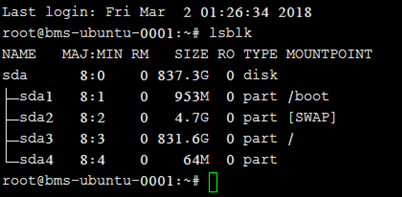
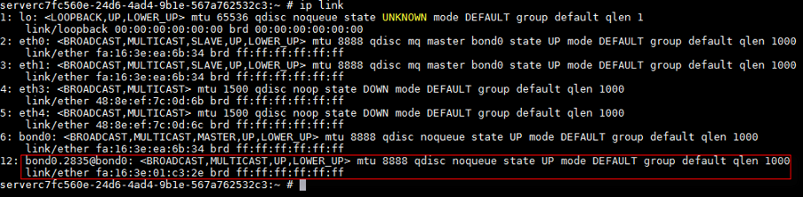
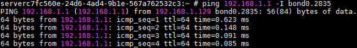

# 配置网卡（SUSE Linux Enterprise Server 12 系列）<a name="bms_01_0058"></a>

## 操作须知<a name="section168138102450"></a>

若使用整机备份恢复裸金属服务器，仅能恢复备份时OS含有的网卡信息，在备份后增删的VPC网卡信息不能自动恢复。备份后新增的VPC网卡在恢复操作后可通过下面的增加网卡流程将网卡信息配置到OS中；备份后删除的VPC网卡在恢复操作后可通过下面的删除网卡流程删除OS中的网卡信息。

下面以SUSE Linux Enterprise Server 12 SP3 \(x86\_64\)操作系统为例，举例介绍裸金属服务器增删VPC网卡的配置方法。

## 增加网卡<a name="section208961921154819"></a>

1.  <a name="li1558174719483"></a>获取新增网卡的信息，如[表1](#table1669415379510)所示。

    **表 1**  信息收集

    <a name="table1669415379510"></a>
    <table><thead align="left"><tr id="row1669543725112"><th class="cellrowborder" valign="top" width="18.181818181818183%" id="mcps1.2.4.1.1"><p id="p369643735111"><a name="p369643735111"></a><a name="p369643735111"></a>参数</p>
    </th>
    <th class="cellrowborder" valign="top" width="63.63636363636363%" id="mcps1.2.4.1.2"><p id="p18696537135118"><a name="p18696537135118"></a><a name="p18696537135118"></a>说明</p>
    </th>
    <th class="cellrowborder" valign="top" width="18.181818181818183%" id="mcps1.2.4.1.3"><p id="p1969613379517"><a name="p1969613379517"></a><a name="p1969613379517"></a>样例</p>
    </th>
    </tr>
    </thead>
    <tbody><tr id="row15696143715112"><td class="cellrowborder" valign="top" width="18.181818181818183%" headers="mcps1.2.4.1.1 "><p id="p4696193725113"><a name="p4696193725113"></a><a name="p4696193725113"></a>VLAN、MAC地址</p>
    </td>
    <td class="cellrowborder" valign="top" width="63.63636363636363%" headers="mcps1.2.4.1.2 "><p id="p2696143775114"><a name="p2696143775114"></a><a name="p2696143775114"></a>VPC网卡的VLAN信息和MAC地址，获取方式如下：</p>
    <a name="ol14133135462114"></a><a name="ol14133135462114"></a><ol id="ol14133135462114"><li>在裸金属服务器页面，单击待配置网卡的裸金属服务器名称。</li><li id="li58541779231"><a name="li58541779231"></a><a name="li58541779231"></a>选择“网卡”页签，在新增的VPC网卡所在行，单击<a name="image733261764518"></a><a name="image733261764518"></a><span></span>，展开网卡详情。</li><li>获取“VLAN”信息、“MAC地址”。</li></ol>
    </td>
    <td class="cellrowborder" valign="top" width="18.181818181818183%" headers="mcps1.2.4.1.3 "><p id="p1569683715512"><a name="p1569683715512"></a><a name="p1569683715512"></a>2835</p>
    <p id="p2086519914612"><a name="p2086519914612"></a><a name="p2086519914612"></a>fa:16:3e:01:c3:2e</p>
    </td>
    </tr>
    <tr id="row1269673714515"><td class="cellrowborder" valign="top" width="18.181818181818183%" headers="mcps1.2.4.1.1 "><p id="p13696183735110"><a name="p13696183735110"></a><a name="p13696183735110"></a>网关</p>
    </td>
    <td class="cellrowborder" valign="top" width="63.63636363636363%" headers="mcps1.2.4.1.2 "><p id="p4696103719515"><a name="p4696103719515"></a><a name="p4696103719515"></a>VPC网卡的网关地址，获取方式如下：</p>
    <a name="ol1433103653118"></a><a name="ol1433103653118"></a><ol id="ol1433103653118"><li id="li32431027104614"><a name="li32431027104614"></a><a name="li32431027104614"></a>在<a href="#li58541779231">2</a>中的网卡详情页面，获取“子网”信息。</li><li>在裸金属服务器详情页面，单击虚拟私有云后的链接，跳转至VPC列表。</li><li>单击裸金属服务器实例所属VPC的名称，进入VPC详情页面。</li><li>单击“子网”页签，找到<a href="#li32431027104614">1</a>中的子网所对应的网关地址。</li></ol>
    </td>
    <td class="cellrowborder" valign="top" width="18.181818181818183%" headers="mcps1.2.4.1.3 "><p id="p9696173714518"><a name="p9696173714518"></a><a name="p9696173714518"></a>192.168.1.1</p>
    </td>
    </tr>
    </tbody>
    </table>

2.  以“root”用户，使用密钥或密码登录裸金属服务器。
3.  执行以下命令，将网络配置文件“/etc/sysconfig/network/ifcfg-bond0”拷贝为“/etc/sysconfig/network/ifcfg-bond0._vlan_”，其中vlan表示[1](#li1558174719483)中获取的值，如2835。

    **cp** **-p** **/etc/sysconfig/network/ifcfg-bond0** **/etc/sysconfig/network/ifcfg-bond0.**_2835_

4.  执行以下命令，编辑“/etc/sysconfig/network/ifcfg-bond0**.**_vlan_”，配置新增VPC网卡的网络配置文件，例如编辑ifcfg-bond0._2835_。

    **vim** **/etc/sysconfig/network/ifcfg-bond0.**_2835_

    按以下格式编辑：

    ```
    STARTMODE=auto
    ETHERDEVICE=bond0
    LLADDR=fa:16:3e:01:c3:2e
    NM_CONTROLLED=no
    BOOTPROTO=dhcp
    DEVICE=bond0.2835
    USERCONTRL=auto
    TYPE=Ethernet
    VLAN_ID=2835
    ```

    其中，

    -   LLADDR为新增VPC网卡的MAC地址，取值参见[1](#li1558174719483)。
    -   DEVICE设置为bond0._vlan_，vlan表示[1](#li1558174719483)中获取的值，如2835。
    -   VLAN\_ID为VLAN的ID，如2835。

    配置完成后，按“Esc”，输入**:wq**保存并退出。

5.  执行以下命令，启动新增的VPC网卡。

    **/usr/sbin/wicked** **ifup** **bond0.**_vlan_

    例如，启动“bond0.2835”：

    

6.  执行以下命令，查看VPC网卡设备的状态。

    

7.  通过指定新增的网络设备ping其网关，验证网络是否正常。

    其中，网关为[1](#li1558174719483)中获取的网关地址。

    


## 删除网卡<a name="section5744173334810"></a>

1.  <a name="li960312341080"></a>获取待删除VPC网卡的VLAN和MAC地址。
2.  以“root”用户，使用密钥或密码登录裸金属服务器。
3.  根据VLAN信息找到网络设备，然后执行**/usr/sbin/wicked** **ifdown** **bond0.**_vlan_删除设备。

    ```
    serverc7fc560e-24d6-4ad4-9b1e-567a762532c3:~ # ip link | grep 2835
    12: bond0.2835@bond0: <BROADCAST,MULTICAST,UP,LOWER_UP> mtu 8888 qdisc noqueue state UP mode DEFAULT group default qlen 1000
    serverc7fc560e-24d6-4ad4-9b1e-567a762532c3:~ #
    serverc7fc560e-24d6-4ad4-9b1e-567a762532c3:~ # /usr/sbin/wicked ifdown bond0.2835
    serverc7fc560e-24d6-4ad4-9b1e-567a762532c3:~ #
    ```

4.  执行以下命令，删除网络配置文件“/etc/sysconfig/network/ifcfg-bond0._vlan_”，其中vlan表示[1](#li960312341080)中获取的VLAN，如2835。

    **rm** **/etc/sysconfig/network/ifcfg-bond0.**_2835_

5.  执行以下命令，删除网络配置文件“/etc/wicked/ifconfig/bond0._vlan_.xml”，其中vlan表示[1](#li960312341080)中获取的VLAN，如2835。

    **rm** **/etc/wicked/ifconfig/bond0.**_2835_**.xml**


