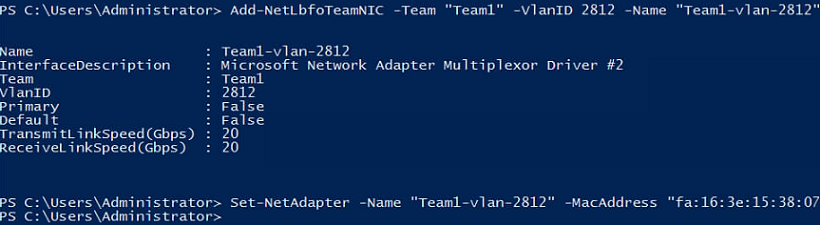

# 配置网卡（Windows Server系列）

下面以Windows Server 2012 R2 Standard操作系统为例，举例介绍裸金属服务器增删VPC网卡的配置方法。

> **说明：**   
>Windows Server系列其他操作系统的配置方法与Windows Server 2012 R2 Standard类似。  

## 增加网卡

1.  获取新增网卡的信息，如[表1](#table1669415379510)所示。

    **表 1**  信息收集

    
    <table><thead align="left"><tr id="row1669543725112"><th class="cellrowborder" valign="top" width="18.181818181818183%" id="mcps1.2.4.1.1">
参数

    </th>
    <th class="cellrowborder" valign="top" width="63.63636363636363%" id="mcps1.2.4.1.2">
说明

    </th>
    <th class="cellrowborder" valign="top" width="18.181818181818183%" id="mcps1.2.4.1.3">
样例

    </th>
    </tr>
    </thead>
    <tbody><tr id="row15696143715112"><td class="cellrowborder" valign="top" width="18.181818181818183%" headers="mcps1.2.4.1.1 ">
VLAN、MAC地址

    </td>
    <td class="cellrowborder" valign="top" width="63.63636363636363%" headers="mcps1.2.4.1.2 ">
VPC网卡的VLAN信息和MAC地址，获取方式如下：

    <ol id="ol14133135462114"><li>在裸金属服务器页面，单击待配置网卡的裸金属服务器名称。</li><li id="li58541779231">选择“网卡”页签，在新增的VPC网卡所在行，单击，展开网卡详情。</li><li>获取“VLAN”信息、“MAC地址”。</li></ol>
    </td>
    <td class="cellrowborder" valign="top" width="18.181818181818183%" headers="mcps1.2.4.1.3 ">
2812

    
fa:16:3e:15:38:07

    </td>
    </tr>
    <tr id="row1269673714515"><td class="cellrowborder" valign="top" width="18.181818181818183%" headers="mcps1.2.4.1.1 ">
网关

    </td>
    <td class="cellrowborder" valign="top" width="63.63636363636363%" headers="mcps1.2.4.1.2 ">
VPC网卡的网关地址，获取方式如下：

    <ol id="ol1433103653118"><li id="li32431027104614">在<a href="#li58541779231">2</a>中的网卡详情页面，获取“子网”信息。</li><li>在裸金属服务器详情页面，单击虚拟私有云后的链接，跳转至VPC列表。</li><li>单击裸金属服务器所属VPC的名称，进入VPC详情页面。</li><li>单击“子网”页签，找到<a href="#li32431027104614">1</a>中的子网所对应的网关地址。</li></ol>
    </td>
    <td class="cellrowborder" valign="top" width="18.181818181818183%" headers="mcps1.2.4.1.3 ">
192.168.1.1

    </td>
    </tr>
    </tbody>
    </table>

2.  登录Windows裸金属服务器。
3.  进入裸金属服务器的Windows PowerShell命令行界面，执行以下命令，查询网卡信息是否有Team1（VPC网络的端口组名称）。

    **Get-NetAdapter**

    -   若有，执行[4](#li27700107517)。
    -   若没有，请联系客服。

    返回信息示例如下：

    

    > **说明：**   
    >其中，“eth0”和“eth1”为承载VPC网络的网络设备。  

4.  执行以下命令，添加VPC网卡。

    **Add-NetLbfoTeamNIC** **-Team** **"Team1"** **-VlanID** _vlan\_id_ **-Name** **"Team1-vlan-**_vlan\_id_**"** **-Confirm:$false**

    **Set-NetAdapter** **-Name** **"Team1-vlan-**_vlan\_id_**"** **-MacAddress** **"mac\_addr"** **-Confirm:$false**

    其中，“Team1”为VPC网络的端口组名称， vlan\_id为[1](#li1558174719483)中获取的VLAN信息，如2812，mac\_addr为[1](#li1558174719483)中获取的MAC地址，如fa:16:3e:15:38:07。

    

5.  执行以下命令，查看VPC网卡设备的状态。

    **Get-NetAdapter**

    返回信息示例如下：

    

6.  通过指定新增的网络设备ping其网关，验证网络是否正常。

    其中，新增网络设备Team1-vlan-2812的IPv4地址为：

    

    网关为[1](#li1558174719483)中获取的网关地址。

    返回信息示例如下：

    

## 删除网卡

1.  获取待删除VPC网卡的VLAN和MAC地址。
2.  登录Windows裸金属服务器。
3.  进入裸金属服务器的Windows PowerShell命令行界面，执行以下命令，查询需要删除的VPC网卡信息。

    **Get-NetLbfoTeamNIC** **-Team** **Team1**

    

4.  执行以下命令，删除VPC网卡。

    **Remove-NetLbfoTeamNIC** **-Team** **"Team1"** **-VlanID** _vlan\_id_

    其中，vlan\_id为[1](#li960312341080)中获取的VLAN信息。

    

5.  执行如下命令，查询网络信息，确认VPC网卡已被删除。

    **Get-NetLbfoTeamNIC** **-Team** **Team1**

    **Get-NetAdapter**

    

