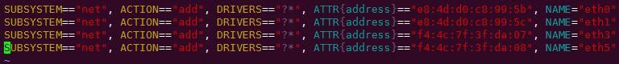
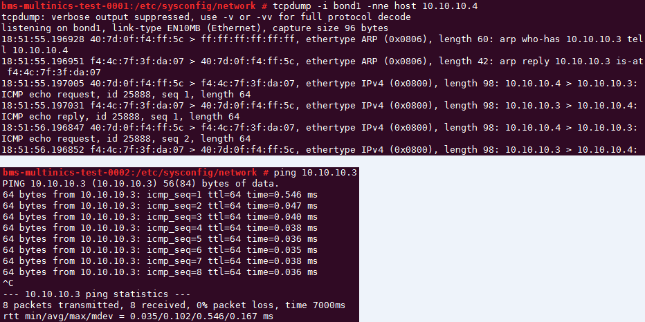

# 配置自定义VLAN网络（RedHat系列，CentOS系列，Oracle Linux系列，Euler系列）<a name="bms_01_0046"></a>

下面以CentOS 6.8 \(x86\_64\)操作系统为例，举例介绍裸金属服务器的自定义VLAN网络配置方法：

> **说明：** 
>RedHat系列、Oracle Linux系列、Euler系列及CentOS系列操作系统的配置方法类似。

1.  以“root”用户，使用密钥或密码登录裸金属服务器。
2.  <a name="li0616194735713"></a>进入裸金属服务器的命令行界面，查询网卡信息。

    **ip** **link**

    返回信息示例如下：

    

    > **说明：** 
    >其中，“eth0”和“eth1”为承载VPC网络的网络设备，“eth3”和“eth5”为承载自定义VLAN网络的网络设备。

3.  执行以下命令，查看“/etc/udev/rules.d/”目录下是否有“80-persistent-net.rules”配置文件。

    **ll** **/etc/udev/rules.d/** **|** **grep** **80-persistent-net.rules**

    -   如果存在“80-persistent-net.rules”，且该配置文件中已存在[2](#li0616194735713)中查询到的除“bond0”和“lo”以外的其它所有网卡和对应的MAC地址，请执行[6](#li1437634425719)。
    -   否则，继续执行[4](#li116366367312)。

4.  <a name="li116366367312"></a>执行以下命令，将“/etc/udev/rules.d/70-persistent-net.rules”文件拷贝一份（文件名为“/etc/udev/rules.d/80-persistent-net.rules”）。

    **cp** **-p** **/etc/udev/rules.d/70-persistent-net.rules** **/etc/udev/rules.d/80-persistent-net.rules**

5.  设置udev规则。

    将[2](#li0616194735713)中查询到的除“eth0”和“eth1”以外的网卡（即“/etc/udev/rules.d/70-persistent-net.rules”中未体现的网卡MAC地址和名称），写入“/etc/udev/rules.d/80-persistent-net.rules”文件中，使得裸金属服务器重启复位后，网卡名称和顺序不会发生改变。

    > **说明：** 
    >网卡的MAC地址和名称中的字母，请使用小写字母。

    **vim** **/etc/udev/rules.d/80-persistent-net.rules**

    修改后的示例如下：

    

    修改完成后，按“Esc”，输入**:wq**保存并退出。

6.  <a name="li1437634425719"></a>执行以下命令，将网络配置文件“/etc/sysconfig/network-scripts/ifcfg-bond0”拷贝为“/etc/sysconfig/network-scripts/ifcfg-bond1”，将网络配置文件“/etc/sysconfig/network-scripts/ifcfg-eth0”拷贝为“/etc/sysconfig/network-scripts/ifcfg-eth3”和“/etc/sysconfig/network/ ifcfg-eth5”。

    **cp** **-p** **/etc/sysconfig/network-scripts/ifcfg-bond0** **/etc/sysconfig/network-scripts/ifcfg-bond1**

    **cp** **-p** **/etc/sysconfig/network-scripts/ifcfg-eth0** **/etc/sysconfig/network-scripts/ifcfg-eth3**

    **cp** **-p** **/etc/sysconfig/network-scripts/ifcfg-eth0** **/etc/sysconfig/network-scripts/ifcfg-eth5**

7.  执行以下命令，编辑“/etc/sysconfig/network-scripts/ifcfg-eth3”和“/etc/sysconfig/network-scripts/ifcfg-eth5”，配置“eth3”设备和“eth5”设备的网络配置文件。
    -   **vim** **/etc/sysconfig/network-scripts/ifcfg-eth3**

        “eth3”按以下格式编辑：

        ```
        USERCTL=no
        MTU=8888
        NM_CONTROLLED=no
        BOOTPROTO=static
        DEVICE=eth3
        TYPE=Ethernet
        ONBOOT=yes
        MASTER=bond1
        SLAVE=yes
        ```

        其中，“BOOTPROTO”参数取值修改为“static”，“DEVICE”为对应的网络设备名称，取值即为“eth3”，“MASTER”为对应的自定义VLAN网络端口的名称，取值如“bond1”，其他参数可保持不变。

    -   **vim** **/etc/sysconfig/network-scripts/ifcfg-eth5**

        “eth5”按以下格式编辑（格式和规则和“eth3”一致）：

        ```
        USERCTL=no
        MTU=8888
        NM_CONTROLLED=no
        BOOTPROTO=static
        DEVICE=eth5
        TYPE=Ethernet
        ONBOOT=yes
        MASTER=bond1
        SLAVE=yes
        ```

8.  执行以下命令，编辑“/etc/sysconfig/network-scripts/ifcfg-bond1”。

    **vim** **/etc/sysconfig/network-scripts/ifcfg-bond1**

    按以下格式编辑：

    ```
    MACADDR=f4:4c:7f:3f:da:07
    BONDING_MASTER=yes
    USERCTL=no
    ONBOOT=yes
    NM_CONTROLLED=no
    BOOTPROTO=static
    BONDING_OPTS="mode=1 miimon=100"
    DEVICE=bond1
    TYPE=Bond
    IPADDR=10.10.10.3
    NETMASK=255.255.255.0
    MTU=8888
    ```

    其中，

    -   “MACADDR”参数取值修改为自定义VLAN网络“eth3”或者“eth5”设备的MAC地址。
    -   “BOOTPROTO”参数取值修改为“static”。
    -   “DEVICE” 参数取值修改为“bond1”。
    -   “IPADDR” 参数取值修改为待给“bond1”分配的IP地址（为自定义VLAN网络规划的IP地址在没有与VPC网段冲突的情况下可任意规划，需要通过自定义VLAN网络通信的裸金属服务器须将自定义VLAN网络配置在同一个网段），如“10.10.10.3”。
    -   “NETMASK”参数为给自定义VLAN网络“bond1”配置的IP的子网掩码。

    其他参数可保持不变。

    修改完成后，按“Esc”，输入**:wq**保存并退出。

9.  执行以下命令，启动自定义VLAN网络端口组“bond1”。

    **ifup** _bond1_

    ```
    Determining if ip address 10.10.10.3 is already in use for device bond1...
    ```

10. 参见上述步骤，完成其他裸金属服务器的配置。
11. 待其他裸金属服务器配置完成后，互相ping对端自定义VLAN网络配置的同网段IP，检查是否可以ping通。

    


