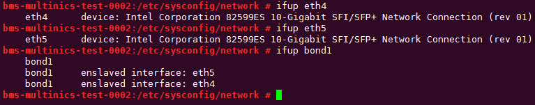
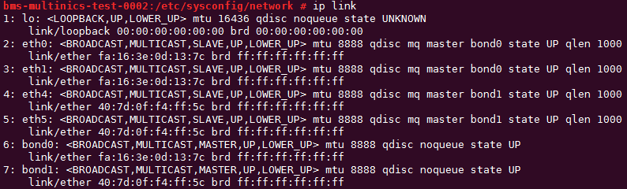
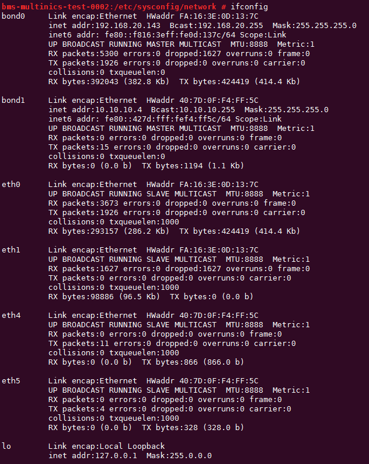
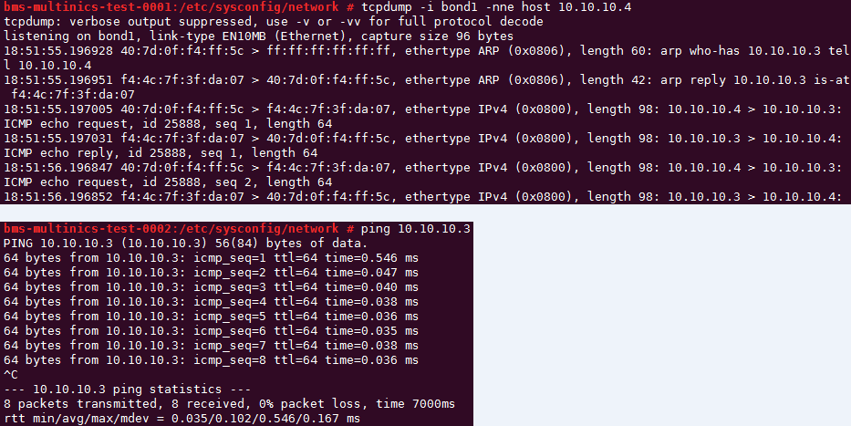

# 配置自定义VLAN网络（SUSE Linux Enterprise Server 11系列）<a name="bms_01_0045"></a>

下面以SUSE Linux Enterprise Server 11 SP4操作系统为例，举例介绍裸金属服务器的自定义VLAN网络配置方法：

1.  以“root”用户，使用密钥或密码登录裸金属服务器。
2.  <a name="li158599132113"></a>进入裸金属服务器的命令行界面，查询网卡信息。

    **ip** **link**

    返回信息示例如下：

    ```
    1: lo: <LOOPBACK,UP,LOWER_UP> mtu 16436 qdisc noqueue state UNKNOWN 
        link/loopback 00:00:00:00:00:00 brd 00:00:00:00:00:00
    2: eth0: <BROADCAST,MULTICAST,SLAVE,UP,LOWER_UP> mtu 8888 qdisc mq master bond0 state UP qlen 1000
        link/ether fa:16:3e:0d:13:7c brd ff:ff:ff:ff:ff:ff
    3: eth1: <BROADCAST,MULTICAST,SLAVE,UP,LOWER_UP> mtu 8888 qdisc mq master bond0 state UP qlen 1000
        link/ether fa:16:3e:0d:13:7c brd ff:ff:ff:ff:ff:ff
    4: eth4: <BROADCAST,MULTICAST> mtu 1500 qdisc noop state DOWN qlen 1000
        link/ether 40:7d:0f:f4:ff:5c brd ff:ff:ff:ff:ff:ff
    5: eth5: <BROADCAST,MULTICAST> mtu 1500 qdisc noop state DOWN qlen 1000
        link/ether 40:7d:0f:f4:ff:5d brd ff:ff:ff:ff:ff:ff
    6: bond0: <BROADCAST,MULTICAST,MASTER,UP,LOWER_UP> mtu 8888 qdisc noqueue state UP 
        link/ether fa:16:3e:0d:13:7c brd ff:ff:ff:ff:ff:ff
    ```

    > **说明：** 
    >其中，“eth0”和“eth1”为承载VPC网络的网络设备，“eth4”和“eth5”为承载自定义VLAN网络的网络设备。

3.  执行以下命令，查看“/etc/udev/rules.d/”目录下是否有“80-persistent-net.rules”配置文件。

    **ll** **/etc/udev/rules.d/** **|** **grep** **80-persistent-net.rules**

    -   如果存在“80-persistent-net.rules”，且该配置文件中已存在[2](#li158599132113)中查询到的除“bond0”和“lo”以外的其它所有网卡和对应的MAC地址，请执行[6](#li79913241686)。
    -   否则，继续执行[4](#li116366367312)。

4.  <a name="li116366367312"></a>执行以下命令，将“/etc/udev/rules.d/70-persistent-net.rules”文件拷贝一份（文件名为“/etc/udev/rules.d/80-persistent-net.rules”）。

    **cp** **-p** **/etc/udev/rules.d/70-persistent-net.rules** **/etc/udev/rules.d/80-persistent-net.rules**

5.  设置udev规则。

    将[2](#li158599132113)中查询到的除“lo”、“eth0”、“eth1”、“bond0”以外的网卡和MAC对应关系添加到“/etc/udev/rules.d/80-persistent-net.rules”文件中，使得裸金属服务器重启复位后，网卡名称和顺序不会发生改变。

    > **说明：** 
    >网卡的MAC地址和名称中的字母，请使用小写字母。

    **vim** **/etc/udev/rules.d/80-persistent-net.rules**

    修改后的示例如下：

    ```
    SUBSYSTEM=="net", ACTION=="add", DRIVERS=="?*", ATTR{address}=="e8:4d:d0:c8:99:67", NAME="eth0"
    SUBSYSTEM=="net", ACTION=="add", DRIVERS=="?*", ATTR{address}=="e8:4d:d0:c8:99:68", NAME="eth1"
    SUBSYSTEM=="net", ACTION=="add", DRIVERS=="?*", ATTR{address}=="40:7d:0f:f4:ff:5c", NAME="eth4"
    SUBSYSTEM=="net", ACTION=="add", DRIVERS=="?*", ATTR{address}=="40:7d:0f:f4:ff:5d", NAME="eth5"
    ```

    修改完成后，按“Esc”，输入**:wq**保存并退出。

6.  <a name="li79913241686"></a>执行以下命令，将网络配置文件“/etc/sysconfig/network/ifcfg-bond0”拷贝为“/etc/sysconfig/network/ifcfg-bond1”，将网络配置文件“/etc/sysconfig/network/ifcfg-eth0”拷贝为“/etc/sysconfig/network/ifcfg-eth4”和“/etc/sysconfig/network/ifcfg-eth5”。

    **cp** **-p** **/etc/sysconfig/network/ifcfg-bond0** **/etc/sysconfig/network/ifcfg-bond1**

    **cp** **-p** **/etc/sysconfig/network/ifcfg-eth0** **/etc/sysconfig/network/ifcfg-eth4**

    **cp** **-p** **/etc/sysconfig/network/ifcfg-eth0** **/etc/sysconfig/network/ifcfg-eth5**

7.  <a name="li1497118353312"></a>执行以下命令，编辑“/etc/sysconfig/network/ifcfg-eth4”和“/etc/sysconfig/network/ifcfg-eth5”，配置“eth4”设备和“eth5”设备的网络配置文件。
    -   **vim** **/etc/sysconfig/network/ifcfg-eth4**

        “eth4”按以下格式编辑：

        ```
        STARTMODE=auto
        MTU=8888
        NM_CONTROLLED=no
        BOOTPROTO=static
        DEVICE=eth4
        USERCONTRL=no
        LLADDR=40:7d:0f:f4:ff:5c
        TYPE=Ethernet
        ```

        其中，“BOOTPROTO”参数取值修改为“static”，“DEVICE”为对应的网络设备名称，取值即为“eth4”，“LLADDR”为对应的网络设备的MAC地址，通过[2](#li158599132113)获取，其它参数可保持不变。

    -   **vim** **/etc/sysconfig/network/ifcfg-eth5**

        “eth5”按以下格式编辑（格式和规则与“eth4”一致）：

        ```
        STARTMODE=auto
        MTU=8888
        NM_CONTROLLED=no
        BOOTPROTO=static
        DEVICE=eth5
        USERCONTRL=no
        LLADDR=40:7d:0f:f4:ff:5d
        TYPE=Ethernet
        ```

8.  执行以下命令，编辑“/etc/sysconfig/network/ifcfg-bond1”。

    **vim** **/etc/sysconfig/network/ifcfg-bond1**

    按如下格式编辑：

    ```
    BONDING_MASTER=yes
    TYPE=Bond
    STARTMODE=auto
    BONDING_MODULE_OPTS="mode=1 miimon=100"
    NM_CONTROLLED=no
    BOOTPROTO=static
    DEVICE=bond1
    USERCONTRL=no
    LLADDR=40:7d:0f:f4:ff:5c
    BONDING_SLAVE1=eth4
    BONDING_SLAVE0=eth5
    IPADDR=10.10.10.4
    NETMASK=255.255.255.0
    MTU=8888
    ```

    其中，

    -   “BOOTPROTO”参数取值修改为“static”。
    -   “DEVICE” 参数取值修改为“bond1”。
    -   “LLADDR” 参数取值修改为[7](#li1497118353312)中任意一个网络设备的MAC地址值，如“40:7d:0f:f4:ff:5c”。
    -   “BONDING\_SLAVE1”和“BONDING\_SLAVE0” 参数取值修改为[7](#li1497118353312)中两个网络设备的设备名称，即取值分别为“eth4” 和“eth5”。
    -   “IPADDR” 参数取值修改为待给“bond1”分配的IP地址（为自定义VLAN网络规划的IP地址在没有与VPC网段冲突的情况下可任意规划，需要通过自定义VLAN网络通信的裸金属服务器须将自定义VLAN网络配置在同一个网段），如“10.10.10.4”。
    -   “NETMASK”参数为给自定义VLAN网络“bond1”分配的IP的子网掩码。
    -   “MTU”参数取值修改为“8888” 。

    其他参数可保持不变。

    修改完成后，按“Esc”，输入**:wq**保存并退出。

9.  执行以下命令，重启网络。

    **ifup** _eth4_

    **ifup** _eth5_

    **ifup** _bond1_

    

    > **说明：** 
    >其中，“eth4”和“eth5”分别为承载自定义VLAN网络的网口，“bond1”为自定义VLAN网络对应的端口组。

10. 执行以下命令，查看网卡设备的状态和“bond1”配置文件是否生效。

    **ip** **link**

    

    **ifconfig**

    

11. 参见上述步骤，完成其他裸金属服务器的配置。
12. 待其他裸金属服务器配置完成后，互相ping对端自定义VLAN网络配置的同网段IP，检查是否可以ping通。

    


