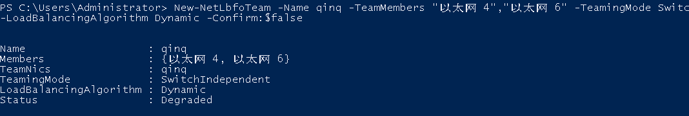
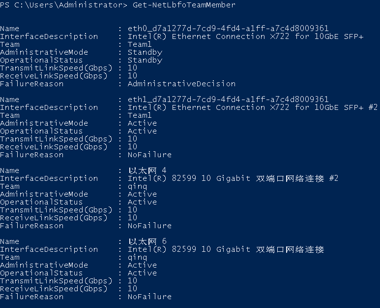
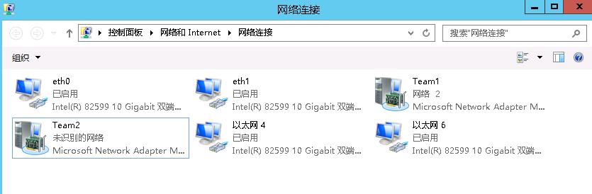

# 配置自定义VLAN网络（Windows Server系列）

下面以Windows Server 2012 R2 Standard操作系统为例，介绍裸金属服务器的自定义VLAN网络配置方法：

> **说明：**   
>Windows Server系列其他操作系统的配置方法与Windows Server 2012 R2 Standard类似。  

1.  登录Windows裸金属服务器。
2.  进入裸金属服务器的Windows PowerShell命令行界面，执行以下命令，查询网卡信息。

    **Get-NetAdapter**

    返回信息示例如下：

    **图 1**  查询网卡命令示例  
    

    > **说明：**   
    >其中，“eth0”和“eth1”为承载VPC网络的网络设备，“以太网 4”和“以太网 6”为承载自定义VLAN网络的网络设备。下面步骤将使用“以太网 4”和“以太网 6”配置自定义VLAN网络。  

3.  如果想提高OS侧出方向流量，请参考[方法一](#li7981720132719)配置；如果对流量没有特殊需求，请参考[方法二](#li15395216102810)配置。
    -   **方法一：OS内组bond**为交换机独立模式**，出方向流量可达到主主的效果，但入方向仍然与主备模式保持一致。**

    1.  执行以下命令，创建自定义VLAN网络的端口组。

        **New-NetLbfoTeam -Name** _qinq_ **-TeamMembers** **"**_以太网 4_**","**_以太网 6_**"** **-TeamingMode SwitchIndependent -LoadBalancingAlgorithm Dynamic -Confirm:$false**

        **图 2**  创建端口组命令示例  
        

        > **说明：**   
        >其中，“qinq”为给自定义VLAN网络端口组规划的端口组名称，“以太网 4”和“以太网 6”为[2](#li11441348154412)中获取的承载自定义VLAN网络的网络设备。  

    2.  执行以下命令，查询网络适配器列表。

        **Get-NetLbfoTeamMember**

        **图 3**  查询网络接口命令示例  
        

        **Get-NetAdapter**

        **图 4**  查询网络适配器命令示例  
        

    -   **方法二：OS内组bond**为主备模式**。**

    1.  执行以下命令，创建自定义VLAN网络的端口组。

        **New-NetLbfoTeam -Name** _Team2_ **-TeamMembers** **"**_以太网4_**","**_以太网 6_**" -TeamingMode SwitchIndependent -LoadBalancingAlgorithm IPAddresses -Confirm:$false**

        **图 5**  创建端口组命令示例  
        

        > **说明：**   
        >其中，“Team2”为给自定义VLAN网络端口组规划的端口组名称，“以太网 4”和“以太网 6”为[2](#li11441348154412)中获取的承载自定义VLAN网络的网络设备。  

    2.  执行以下命令，设置[3.a](#li125519380337)中创建的“Team2”端口组中一个网口模式为备用模式。

        **Set-NetLbfoTeamMember -Name "**_以太网 4_**"** **-AdministrativeMode Standby -Confirm:$false**

        > **说明：**   
        >当前自定义VLAN网络配置的端口组只支持主备模式，其中，“以太网 4”为组成自定义VLAN网络端口组中的其中一个端口，配置哪个端口为备用端口，根据您的规划自行决定。  

        **get-NetLbfoTeamMember**

        **图 6**  查询网络接口命令示例  
        

        **Get-NetAdapter**

        **图 7**  查询网络适配器命令示例  
        

4.  执行以下命令，进入“网络连接”界面。

    **ncpa.cpl**

    执行完成后，进入如下界面：

    **图 8**  网络连接界面  
    

5.  配置自定义VLAN网络。
    1.  在“网络连接”界面，双击在[3](#li202764020268)中创建的端口组“Team2”，进入“Team2 状态”页面。
    2.  单击“属性”，进入“Team2 属性”页面。
    3.  在“网络”页签下双击“Internet 协议版本 4 \(TCP/IPv4\)”，进入“Internet 协议版本 4 \(TCP/IPv4\) 属性”页面。
    4.  选择“使用下面的IP地址”，配置自定义VLAN网络的IP地址和子网掩码，单击“确定”。

        **图 9**  Internet 协议版本 4 \(TCP/IPv4\) 属性  
        -属性.png "Internet-协议版本-4-(TCP-IPv4)-属性")

        > **说明：**   
        >其中，为自定义VLAN网络规划的IP地址在没有与VPC网段冲突的情况下可任意规划，需要通过自定义VLAN网络通信的裸金属服务器须将自定义VLAN网络配置在同一个网段。  

6.  参见上述步骤，完成其他裸金属服务器的配置。
7.  待其他裸金属服务器配置完成后，互相ping对端自定义VLAN网络配置的同网段IP，检查是否可以ping通。

    **图 10**  网络连通性验证  
    

8.  如果需要在此基础上配置VLAN子接口进行网络平面隔离，可以进行如下操作：

    执行以下命令，在已有Team2基础上建立VLAN子接口。

    **Add-NetLbfoTeamNIC -Team "Team2" -VlanID** _XXX_ **-Confirm:$false**

    其中“Team2”为组建bond的名称，“XXX”为VLAN ID。

    **图 11**  配置VLAN子接口  
    

    新建VLAN子接口完成后，参考[4](#li1133314684418)和[5](#li129292252615)完成网口“Team2-VLAN 500”的IP和掩码等网络设置。

