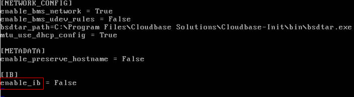

# 重建裸金属服务器<a name="bms_01_0039"></a>

## 操作场景<a name="section60394636111543"></a>

裸金属服务器硬件损坏，SDI卡损坏等原因，导致裸金属服务器无法正常使用时，您可以申请裸金属服务器重建功能。

> **说明：** 
>裸金属服务器重建过程不是自动化的，您需要联系管理员来完成操作。

## 重建须知<a name="section37447471165714"></a>

-   仅快速发放型裸金属服务器支持重建。
-   重建操作成功后，裸金属服务器会自动开机。
-   如果使用了IB网卡，重建前需要记录IB网卡的IP地址。
-   如果使用了QinQ网络，重建前需要记录QinQ网络的IP地址。

## 约束与限制<a name="section4500313111616"></a>

-   仅支持在同一POD中重建，无法重建到其他POD。
-   需要确保裸金属服务器的系统盘是云硬盘。
-   重建后本地磁盘数据无法迁移。

## 前提条件<a name="section2641260214160"></a>

-   待重建的裸金属服务器需处于“关机”状态。
-   待重建的快速发放型裸金属服务器挂载有系统盘。

## 操作步骤<a name="section1234316614565"></a>

1.  使用了QinQ网络的裸金属服务器，在重建前需要租户删除原有QinQ网络的相关配置。例如：原来使用eth3和eth5组成bond1作为QinQ的端口组，所需要删除的配置文件如下：

    **rm** **/etc/udev/rules.d/80-persistent-net.rules**

    **rm** **/etc/sysconfig/network-scripts/ifcfg-eth3**

    **rm** **/etc/sysconfig/network-scripts/ifcfg-eth5**

    **rm** **/etc/sysconfig/network-scripts/ifcfg-bond1**

2.  联系管理员，申请裸金属服务器重建。
    -   使用了QinQ网络的场景，重建成功后，需要租户按照当前的QinQ网络信息并参考[配置自定义VLAN网络（SUSE Linux Enterprise Server 12系列）](配置自定义VLAN网络（SUSE-Linux-Enterprise-Server-12系列）.md)\~[配置自定义VLAN网络（Windows Server系列）](配置自定义VLAN网络（Windows-Server系列）.md)章节重新配置。
    -   使用了IB网络并且IB网卡为动态配置的场景，重建成功后，IP地址会变化。如果租户的业务强依赖IP地址，则需要使用静态配置方法重新配置IB网络的IP，参考以下方法将IB网卡的IP地址配置为重建前的IP地址。
        1.  登录裸金属服务器操作系统。
        2.  新建配置文件“/etc/sysconfig/network-scripts/ifcfg-ib0”，此处以CentOS操作系统为例，IPADDR填写重建前的裸金属服务器的IP地址：

            ```
            #/etc/sysconfig/network-scripts/ifcfg-ib0
            DEVICE=ib0
            ONBOOT=yes
            BOOTPROTO=none
            IPADDR=172.31.0.254
            NETWORK=172.31.0.0
            BROADCAST=172.31.0.255
            NETMASK=255.255.255.0
            ```

        3.  修改配置文件“/opt/huawei/network\_config/bms-network-config.conf”中的“enable\_ib”值为“False”。

            **图 1**  修改参数取值<a name="fig33321881271"></a>  
            

        4.  配置完成后保存并退出，然后重启网卡。

            **ifdown** **ib0**

            **ifup** **ib0**

        5.  查看配置的IP是否生效。

            **ifconfig** **ib0**


