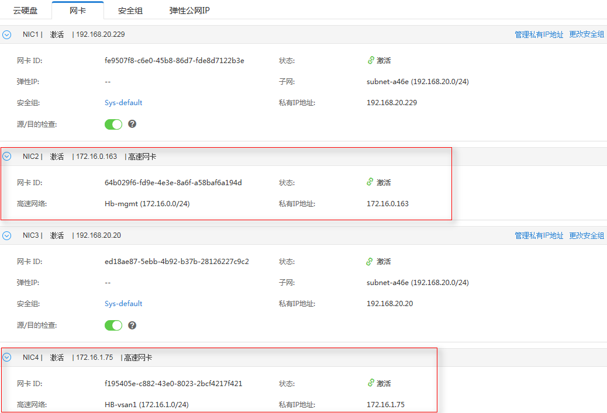
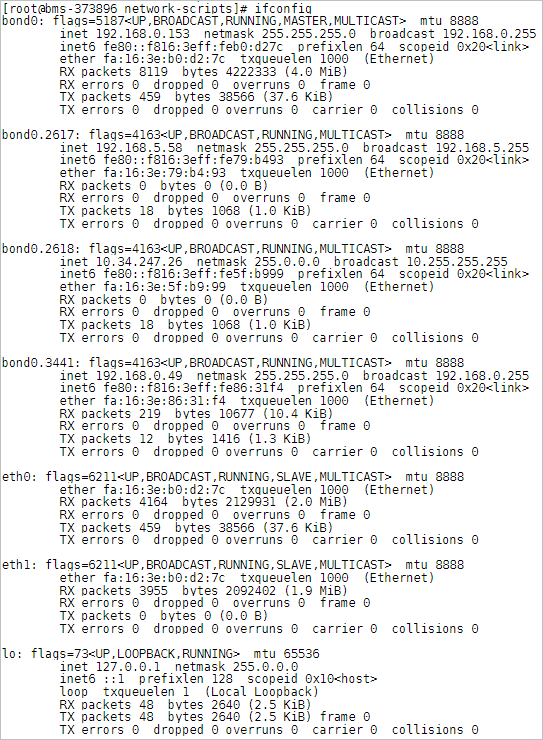
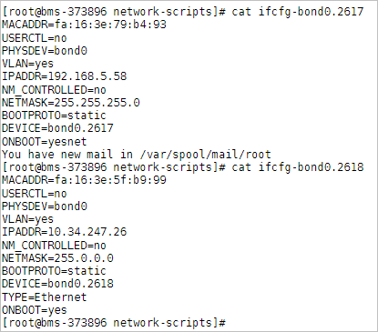

# 高速网络概述

## 高速网络

高速网络是裸金属服务器的内部网络，与VPC共享一个物理平面，用户通过管理控制台创建高速网络后，系统会在裸金属服务器操作系统中建立一个专有的vlan子接口，提供网络数据通信。使用10G port。高速网络只有东西流量，且没有三层路由功能，用于节点间内部二层通信。

> **说明：** 
>目前，部分区域的高速网络已升级为性能更强的增强高速网络，详细说明请参见[增强高速网络概述](增强高速网络概述.md)。

## 高速网卡查看方式

高速网络的网络接口可以在管理控制台查看（裸金属服务器详情页“网卡”页签下，如[图1](#fig1764511386206)所示）。对于Linux镜像，也可以根据分配的IP地址在操作系统中找到对应的vlan子接口或bond接口。

**图 1**  查看高速网卡  

以CentOS 7.4 64 bit为例，登录到操作系统中，在“/etc/sysconfig/network-scripts”目录下可以看到以下网卡配置文件：ifcfg-eth0，ifcfg-eth1，ifcfg-bond0，ifcfg-bond0.3441，ifcfg-bond0.2617，ifcfg-bond0.2618，用户需要通过IP映射来匹配网络。

执行**ifconfig**命令，从控制台查看2张高速网卡的私有IP地址分别为192.168.5.58和10.34.247.26，因此可以确定，ifcfg-bond0.2617、ifcfg-bond0.2618为高速网卡配置文件。

各网卡和bond配置文件的配置信息如下：

